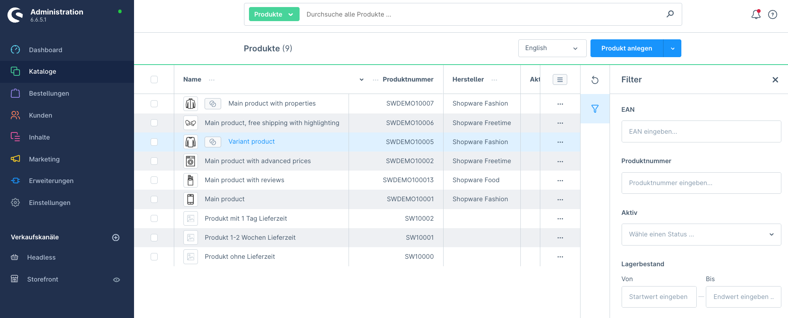

# Shopware 6 Plugin: Produktnummer- und EAN-Filter in der Administration

Unser neues Plugin erweitert die Shopware 6 Administration um eine äußerst nützliche Funktion: die Möglichkeit, Produkte gezielt nach Produktnummer (SKU) und EAN (Europäische Artikelnummer) zu filtern. Diese zusätzlichen Filteroptionen bieten eine wesentlich schnellere und präzisere Suchfunktion, die besonders bei großen Produktbeständen unverzichtbar ist.

Insgesamt bietet unser Plugin eine erhebliche Verbesserung der Produktverwaltung in Shopware 6, indem es präzisere, schnellere und zuverlässigere Such- und Filtermöglichkeiten bereitstellt. Besonders für Shops mit großen Produktbeständen ist diese Erweiterung ein unverzichtbares Werkzeug, um den administrativen Aufwand zu minimieren und die Effizienz im Arbeitsalltag zu steigern.

* Vorteile des Plugins
* Präzise und zielgerichtete Filterung
* Deutlich schnellere Suchergebnisse
* Zuverlässigkeit bei großen Produktbeständen
* Verbesserte Benutzerfreundlichkeit

## Unterstützte Shopware Versionen und Changelog

Stand 16.08.2024:
- *Version 1:* Shopware 6.5.* (bis  6.5.8.13 getestet)
- *Version 2:* Shopware 6.6.* (bis 6.6.5.1 getestet)
- [CHANGELOG](AreanetAdminfilter/CH*ANGELOG.md)
- [Download](https://github.com/AREA-NET-GmbH-Shopware-Agentur/shopware6-plugin-productnumber-ean-admin-filter/releases/)
- 
## Hauptfunktionen des Plugins

* **Wochenenden von der Lieferzeitberechnung ausschließen:** Vermeiden Sie falsche Lieferzeitangaben, indem Sie Samstage und/oder Sonntage von der Berechnung ausschließen. So erhalten Ihre Kunden realistische Lieferdaten, auch bei Bestellungen kurz vor dem Wochenende.
* **Automatische Standard-Lieferzeit für Produkte ohne spezifische Angabe:** Sparen Sie wertvolle Zeit und Nerven, indem das Plugin automatisch die Lieferzeit der Standard-Versandart des Verkaufskanals anzeigt, wenn bei einem Produkt keine spezifische Lieferzeit hinterlegt ist. Keine leeren Felder mehr – keine verwirrten Kunden!
* **Erweiterte Lieferzeitangaben in E-Mail-Templates:** Verbessern Sie die Kommunikation mit Ihren Kunden! Unser Plugin stellt Ihnen zusätzliche Variablen für die exakten Lieferzeiten (sowohl für die gesamte Bestellung als auch für einzelne Positionen) in den Bestellbestätigungs-E-Mails zur Verfügung.

## Support

Wir bieten zu unseren Open-Source-Plugins kostenpflichtigen Support and

* [Online-Formular](https://www.area-net.de/kontakt)
* [shopware@area-net.de](mailto:shopware@area-net.de)

## Shopware Theme und Plugins

Neben kostenlosen Open-Source Shopware-Plugins bietet die Shopware-Agentur auch Themes und Plugins im Shopware-Store an:

- [aloha Theme](https://store.shopware.com/en/arean62788672693m/a-better-cms-theme-optimized-checkout-b2b-functions-flexibly-customizable.html) mit optimiertem Checkout
- [aloha CMS Elements](https://store.shopware.com/arean13931131788m/a-better-cms-elements-slider-bilder-html5-video-google-maps-vorher-nachher-bilder.html) mit umfangreichen Erweiterungen der Standard-Inhaltselemente
- [Pagespeed Booster](https://store.shopware.com/arean41766445685m/pagespeed-booster-paypal-und-externe-skripte-auf-der-startseite-deaktivieren.html) deaktiviert PayPal und Co. auf der Startseite
- [Optimierte Inhaltsbearbeitung](https://store.shopware.com/arean36129443353f/optimierte-inhaltsbearbeitung-inhalte-nur-im-designer-bearbeiten-inhalte-in-layout-uebertragen.html) für CMS-Seiten und Kategorien
- [HTTP-Auth](https://store.shopware.com/arean97586892435f/http-authentifizierung-fuer-verkaufskanaele.html) für Verkaufskanäle

## AREA-NET GmbH
Die AREA-NET GmbH ist Shopware Partner Agentur und Shopware Hersteller, sowie Pickware Partner aus dem Großraum Stuttgart in Baden-Württemberg/Deutschland.

**Adresse**\
Öschstrasse 33\
73072 Donzdorf

Telefon: +49 (0)7162 - 941140\
Mail: [shopware@area-net.de](mailto:shopware@area-net.de)\
Web: [www.area-net.de](https://www.area-net)

Mehr Informationen, Projektanfragen und Support gibt es auf der Website der [Shopware-Agentur AREA-NET GmbH](https://www.area-net.de).

**Follow us**

- https://linkedin.com/companyarea-net-gmbh-shopware-agentur
- https://www.facebook.com/area.net.gmbh

